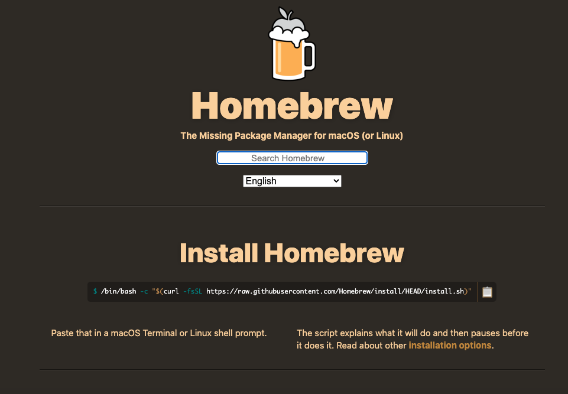

# Homebrew ( Install and Use )

Home Page: [https://brew.sh/](https://brew.sh/)

Packages List: [https://formulae.brew.sh/](https://formulae.brew.sh/)

##### Basic Comands List

| Description | Command |
|--------|--------|
| Search package | brew search |
| Information about a package | brew info |
| Install a package | brew install "package" |
| List installed packages | brew list |
| Update packages | brew update |
| Update a package | brew update "package" |
| Uninstall a package | brew uninstall "package" |
| Remove dead symlinks  | brew prune |
| Remove old versions  | brew cleanup |
| Check by problem | brew doctor |

