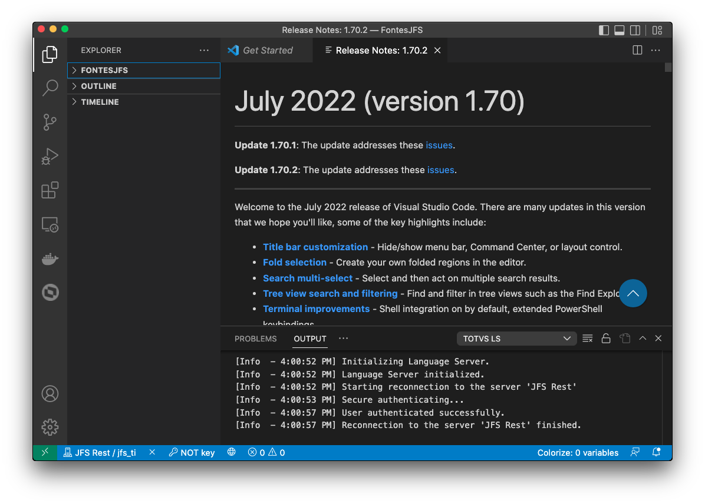

# Visual Studio Code

I just love...

Download: [https://code.visualstudio.com/](https://code.visualstudio.com/)



## Contents
- [VSCode and C/C++](#vscode---cc)
- [VSCode and C#](#vscode---c)
- [VSCode and Java](#vscode---java)
___

### VSCode - C/C++

Install: [C++ extension for VS Code](https://marketplace.visualstudio.com/items?itemName=ms-vscode.cpptools)

For **macOS**
Check CLang is intalled on *macOS*

```bash
clang --version
```
If is not installed, try it.
```bash
xcode-select --install
```
Now... Test

```clang
#include <iostream>

using namespace std;

int main()
{
    cout << " Hello World... " << endl;
}
```

---

### VSCode - C#

Install: [.NET SDK](https://dotnet.microsoft.com/download)
Install: [C# Extension](https://marketplace.visualstudio.com/items?itemName=ms-dotnettools.csharp)
Install: [F# Extension](https://marketplace.visualstudio.com/items?itemName=Ionide.Ionide-fsharp)

Now check .NET version installed.
```bash
dotnet --version
```

C#
Use *Terminal* to initialize C#.
```bash
dotnet new console
```

Run using *Terminal*.
```bash
dotnet run
```

F#
Use *Terminal* do initialize a F#.
```bash
dotnet new console -lang "F#"
```

Open *VSCode*.
```bash
code .
```

Run using *Terminal*.
```bash
dotnet run
```


---

### VSCode - Java

Install: [Extension Pack for Java](https://marketplace.visualstudio.com/items?itemName=vscjava.vscode-java-pack)

---

### VSCode - PHP


---

### VSCode - Python

